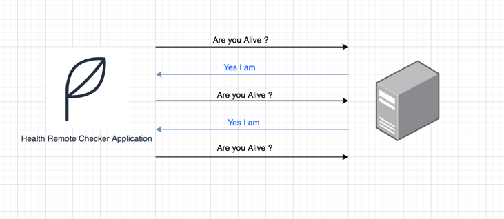
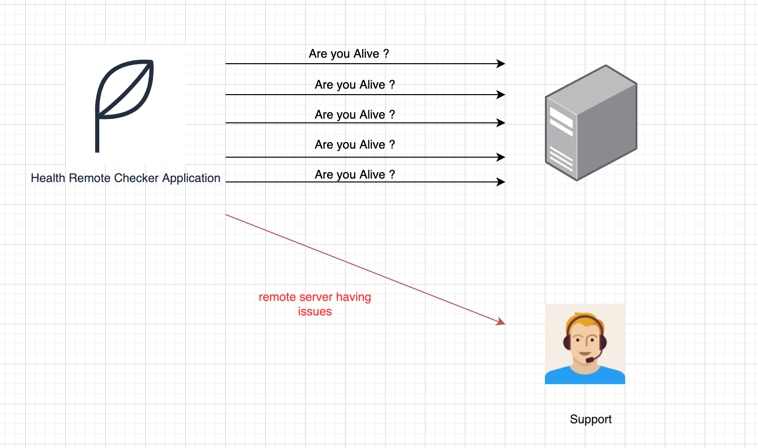

# Remote Server Health Checker
----

## Overview
The all idea from this application is to monitor the status for remote server and send email to technical support in case the server was down. 

## How it works ?
the health application checker will continually send `PING` request using `ICMP` protocol with buffer `1 sec`, and if the application received 5 `tiemout` or `unreachable` response consecutively that means the server having issue and email will be 
sent out to technical support to knowledge them to investigate and take action.

#### Ideal case (server up)

#### Server having issues (server down)

---- 
## Getting Started

### Installation
1. Clone the repo
2. Add the remote host address that need to be monitored 
3. Add timeout in millisecond
4. run the application

----

## License
[MIT](https://choosealicense.com/licenses/mit/)